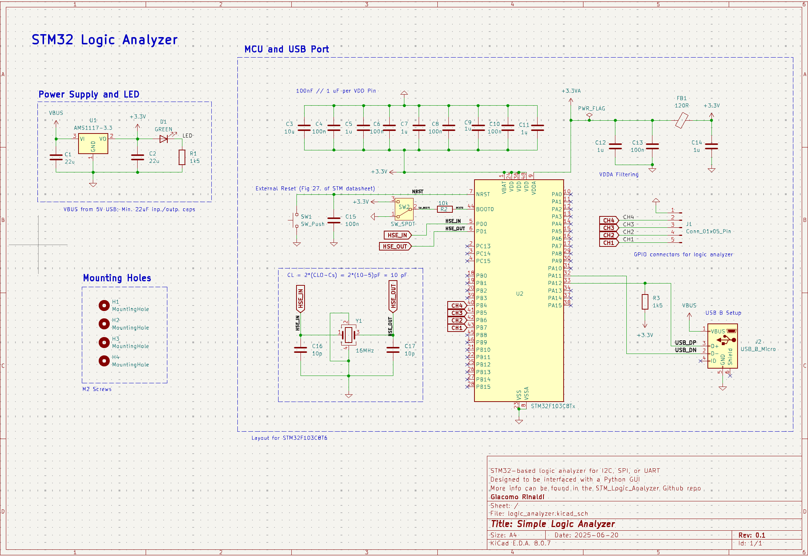
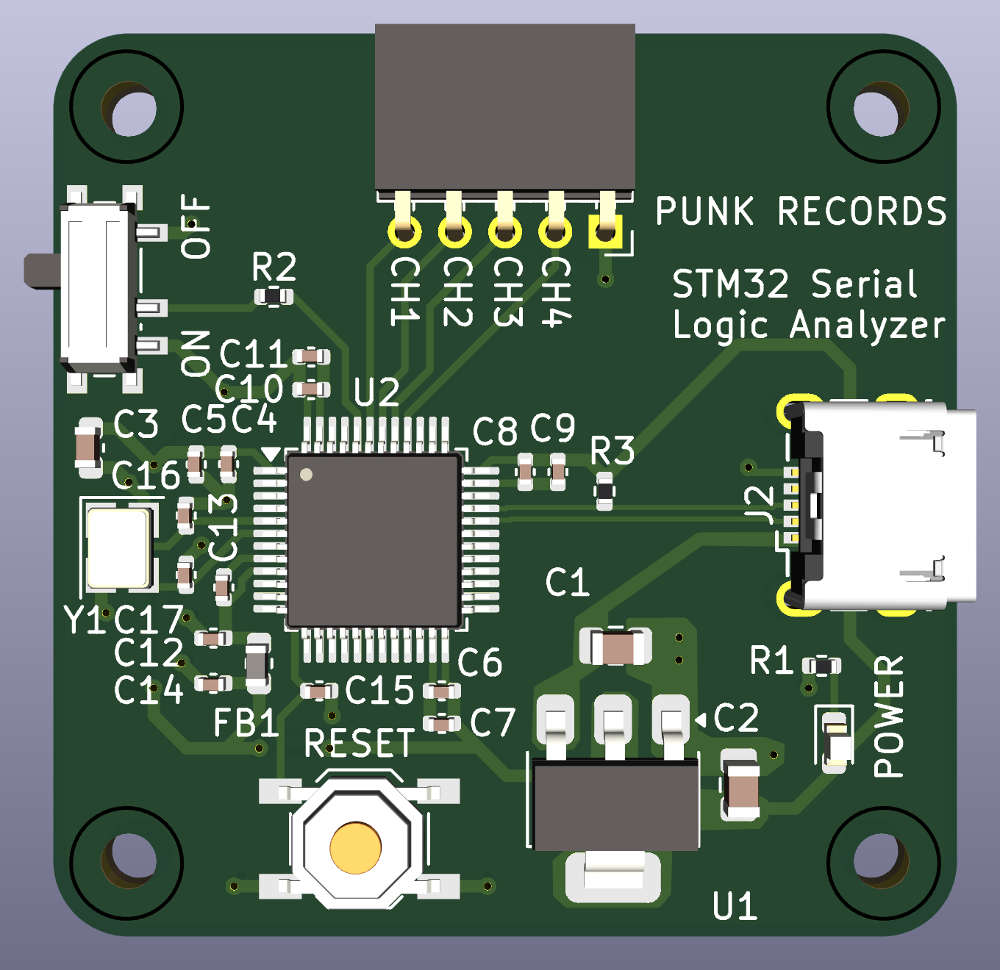
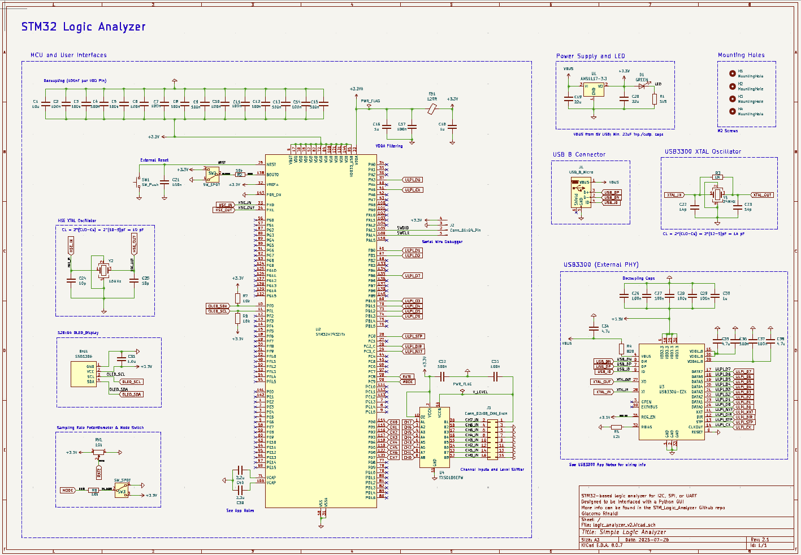
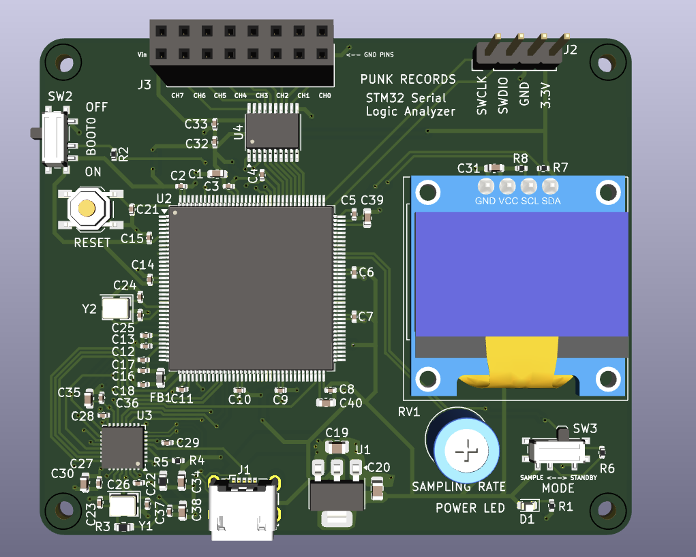

# STM32 Logic Analyzer

A versatile 4-channel logic analyzer built around the STM32F103 microcontroller, designed for analyzing digital communication protocols including I2C, SPI, and UART.

## Overview

This project implements a dual-mode logic analyzer capable of capturing and analyzing digital signals:

- **Polling Mode**: Continuously samples all 4 channels at regular intervals using DWT (Data Watchpoint and Trace) cycle counting for precise timing
- **Interrupt Mode**: Event-driven sampling that captures signal transitions (rising/falling edges) with timestamps, optimized for analyzing communication protocols

The device streams captured data over USB and includes Python scripts for visualization and protocol decoding.

### Circuit Shematic
<div align="center">
  
</div>

### PCB Layout
<div align="center">
  
</div>

### Device in Use
<table>
  <tr>
    <td></td>
    <td></td>
  </tr>
  <tr>
    <td align="center">SPI Wiring</td>
    <td align="center">Example Trace</td>
  </tr>
</table>

### Current Work - 2nd Iteration of Device
<table>
  <tr>
    <td></td>
    <td></td>
  </tr>
  <tr>
    <td align="center">V2.0 Circuit Schematic</td>
    <td align="center">V2.0 PCB</td>
  </tr>
</table>

## Features

- **4-Channel Digital Input**: Simultaneous monitoring of up to 4 digital signals
- **Dual Operating Modes**:
  - Polling mode for continuous sampling
  - Interrupt mode for edge-triggered event capture
- **Protocol Support**: Built-in decoding for I2C, SPI, and UART communication protocols
- **USB Connectivity**: Real-time data streaming via USB CDC (Virtual COM Port)
- **Python Integration**: Comprehensive plotting and decoding scripts for data analysis
- **High-Resolution Timing**: Utilizes STM32's DWT cycle counter and cascaded timers for precise timestamping
- **Efficient Data Handling**: Double-buffered data collection to minimize sample loss

## Hardware Specifications

- **MCU**: STM32F103 (72MHz ARM Cortex-M3)
- **Input Channels**: 4 channels (CH1-CH4) on pins PB4-PB7
- **Sample Rate**: Variable depending on mode
- **Data Interface**: USB 2.0 Full Speed
- **Power**: USB-powered
- **Input Voltage**: 3.3V logic levels

## Setup Instructions

### PCB Assembly
1. Order the PCB from JLCPCB using the production files in the `pcb_production_files/` folder
2. Solder components according to the provided schematic
3. Ensure proper USB connector installation for data communication

### Firmware Installation

**Option 1: SWD Programming**
1. Connect an ST-Link or compatible SWD programmer to the SWDIO and SCLK pins on the STM32F103
2. Flash the appropriate firmware binary (polling or interrupt mode)
3. Reset the device

**Option 2: DFU Bootloader**
1. Upload the bootloader from the `misc/` folder using SWD
2. Connect the device via USB
3. Use DFU utilities to upload the main firmware over USB

### Software Setup
1. Install Python dependencies for the analysis scripts
2. Connect the logic analyzer to your computer via USB
3. Connect target device signals to channels CH1-CH4
4. Run the Python plotting script to capture and visualize data
5. Use the decoding script to analyze communication protocols

### Usage Workflow
```bash
# 1. Capture data
python polling_plotter.py

# 2. Decode protocols
python polling_decoder.py
```

## Operating Modes

### Polling Mode
- Continuously samples all 4 channels at maximum rate
- Provides complete signal history with regular time intervals
- Best for analyzing continuous signals or unknown protocols
- Uses DWT cycle counter for precise timing
- Double-buffered operation prevents data loss during USB transmission

### Interrupt Mode
- Event-driven capture on signal transitions
- Efficient for sparse signals and protocol analysis
- Captures rising and falling edges with precise timestamps
- Uses cascaded TIM2/TIM3 timers for extended timing range
- Automatically shuts down after ~1.74 minutes to prevent timer overflow

## Data Format

### Polling Mode
```c
typedef struct {
    uint32_t timestamp;  // DWT cycle count
    uint8_t value;       // 4-bit channel states (PB4-PB7)
} Sample;
```

### Interrupt Mode
```
32-bit data format:
- Bit 31: Edge type (1=rising, 0=falling)
- Bits 30-29: Channel number (0-3)
- Bits 28-0: Timestamp (29-bit timer value)
```

## Python Scripts

The included Python scripts provide:
- **Data Visualization**: Real-time plotting of captured signals
- **Protocol Decoding**: Automatic analysis of I2C, SPI, and UART communications
- **Export Capabilities**: Save captured data in various formats
- **Customizable Analysis**: Modify scripts for specific protocols or requirements

## Development Plans

- **Hardware Upgrades**:
  - Migrate to higher-performance STM32 module with increased clock speed
  - Add external SRAM for larger capture buffers
  - Implement DMA-based USB transfers for improved throughput

- **Software Enhancements**:
  - Real-time protocol decoding during capture
  - Enhanced user interface for data visualization
  - Trigger functionality for complex capture scenarios

- **Performance Improvements**:
  - Optimize sampling rates and buffer management
  - Implement compression for longer capture sessions
  - Add hardware-based triggering capabilities

## Contributing

Contributions are welcome! Please feel free to submit issues, feature requests, or pull requests to improve the logic analyzer's functionality. This is an ongoing project that I plan to keep enhancing over time.

## Troubleshooting

- **Device not recognized**: Ensure USB drivers are properly installed
- **No data capture**: Verify connections to CH1-CH4 pins and signal voltage levels
- **Timing issues**: Check that target device and logic analyzer share common ground
- **Buffer overflow**: Reduce sampling rate or increase USB transfer frequency